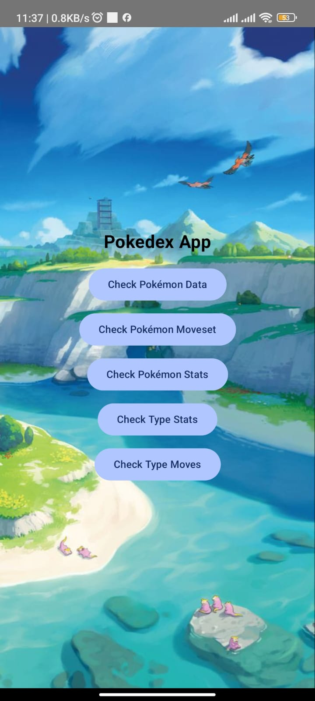
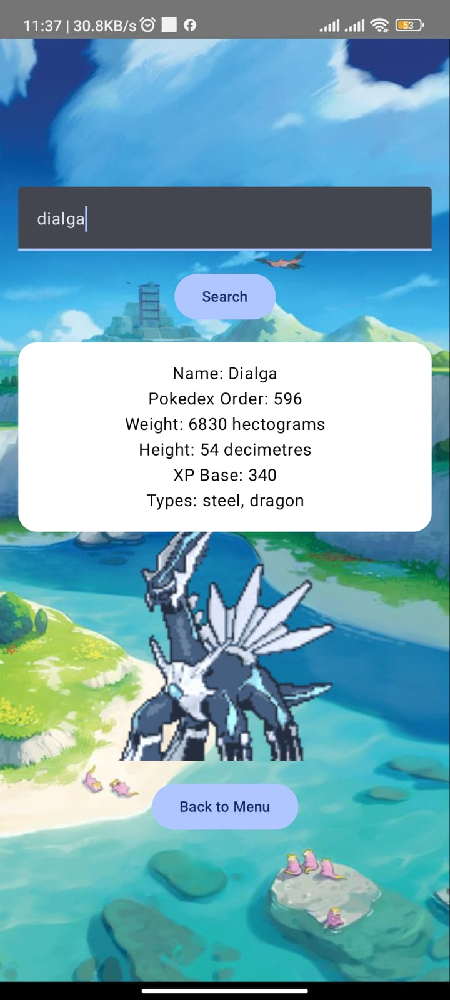
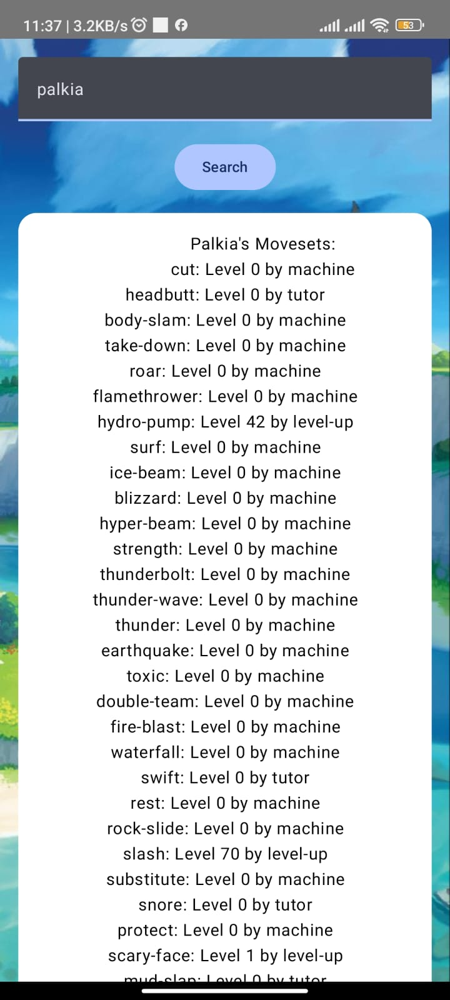
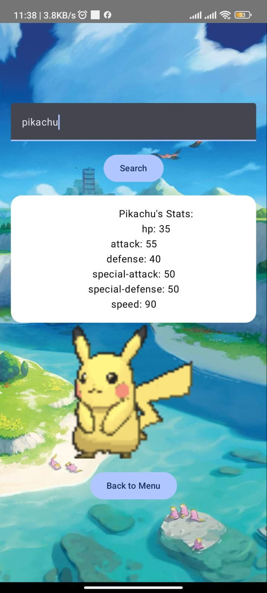
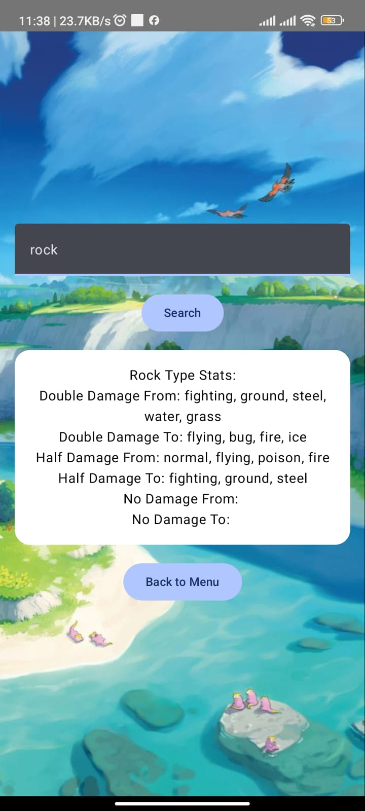
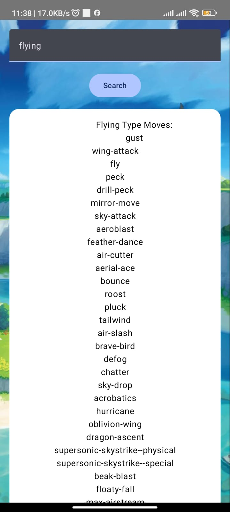

# Pokedex App

A modern, lightweight, and interactive Pokedex application built using [PokeAPI](https://pokeapi.co). This app allows users to search for and explore detailed information about their favorite Pokémon, including stats, abilities, types, and more.

## Screenshots

        

## API Endpoints

The app fetches data from [PokeAPI](https://pokeapi.co). Below are the key endpoints used:

- **Pokémon Details**: `https://pokeapi.co/api/v2/pokemon/{id or name}`
- **Types**: `https://pokeapi.co/api/v2/type`
